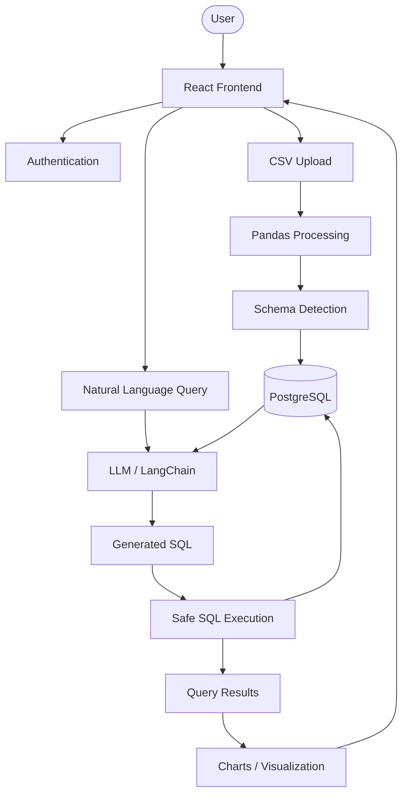

# Senselytics

> AI-powered data analytics platform that allows users to query CSV datasets using natural language.

## What it does

Senselytics converts uploaded CSV datasets into queryable PostgreSQL tables and allows users to ask questions about their data in natural language.

The system uses an LLM to generate SQL queries, executes them safely against PostgreSQL, and returns the results for visualization.

## Architecture



## Key Components

### CSV Processing

Uses Pandas to process uploaded CSV files and detect their structure and datatypes.

### PostgreSQL Storage

Datasets are converted into PostgreSQL tables, providing a structured database layer for querying.

### Natural Language to SQL

Users can ask questions about their datasets in natural language. LangChain and an LLM are used to generate SQL queries from the user's request.

### Safe SQL Execution

Generated SQL is validated and executed against the appropriate dataset rather than allowing unrestricted database operations.

### Data Visualization

Query results can be presented as charts and visualizations to make analytical results easier to understand.

### Authentication

Provides user authentication and protected API access.

## Project Structure

```text
Senselytics/
├── backend/
│   ├── app/
│   │   ├── api/
│   │   ├── core/
│   │   ├── crud/
│   │   ├── db/
│   │   └── evals/
│   └── alembic/
│
├── frontend/
└── README.md
```

## Tech Stack

- Python
- FastAPI
- PostgreSQL
- SQLAlchemy
- Alembic
- Pandas
- LangChain
- React
- Plotly

## Getting Started

### Backend

```bash
cd backend

python -m venv .venv
```

Activate the virtual environment:

**Windows**
```bash
.venv\Scripts\activate
```

Install dependencies:

```bash
pip install -r requirements.txt
```

Configure the required environment variables and PostgreSQL database, then run:

```bash
uvicorn app.main:app --reload
```

### Frontend

```bash
cd frontend
npm install
npm run dev
```

## Current Status

### Completed

- CSV ingestion and processing
- Automatic datatype detection
- PostgreSQL dataset storage
- User authentication
- Natural-language query workflow
- AI-generated SQL
- SQL execution
- Query evaluation infrastructure
- Frontend integration

### Roadmap

- Improve SQL generation accuracy
- Improve query validation and safety
- Expand visualization capabilities
- Improve frontend experience
- Deploy the application

## License

MIT
